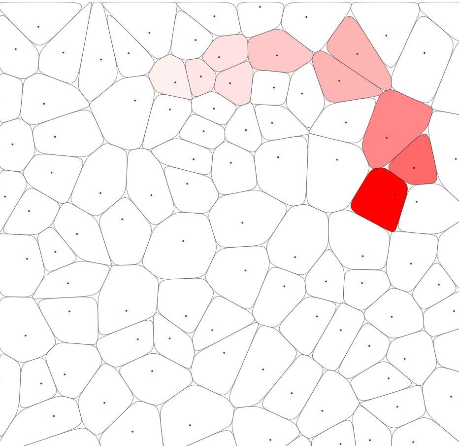

[](https://choosealicense.com/licenses/mit/)
[](https://opensource.org/licenses/)
[](http://www.gnu.org/licenses/agpl-3.0)

# Pavage de Voronoï



## Liens

- https://fr.wikipedia.org/wiki/Diagramme_de_Vorono%C3%AF
- https://github.com/gorhill/Javascript-Voronoi
- http://www.raymondhill.net/voronoi/rhill-voronoi.html

> Le pavage de Voronoi, également appelé diagramme de Voronoi, est une méthode de partitionnement de l'espace autour d'un ensemble de points distincts en régions convexes. Chaque région, appelée cellule de Voronoi, est constituée de tous les points qui sont plus proches du point source correspondant (également appelé site) que de tout autre point source.
Pour générer un pavage de Voronoi, vous pouvez utiliser la bibliothèque d3-voronoi pour JavaScript. Voici comment créer un pavage de Voronoi avec des cellules aux bords arrondis et des points rouges au centre :

Ajoutez les bibliothèques p5.js et d3-voronoi à votre fichier HTML :

```html
<!DOCTYPE html>
<html lang="fr">
<head>
    <meta charset="UTF-8" />
    <title>Canvas avec pavage de Voronoi</title>
    <script src="https://cdnjs.cloudflare.com/ajax/libs/p5.js/1.4.0/p5.js"></script>
    <script src="https://d3js.org/d3-array.v2.min.js"></script>
    <script src="https://d3js.org/d3-voronoi.v1.min.js"></script>
    <script src="sketch.js"></script>
</head>
<body>
</body>
</html>
```
Remplacez le contenu de votre fichier sketch.js par le code suivant :

```javascript

const points = [];
const nPoints = 100;

function setup() {
	createCanvas(windowWidth, windowHeight);
	// Générer des points aléatoires
	for (let i = 0; i < nPoints; i++) {
		points.push([random(width), random(height)]);
	}
	// Créer un diagramme de Voronoi à partir des points générés
	const voronoi = d3.voronoi().extent([[0, 0], [width, height]]);
	const diagram = voronoi(points);
	const polygons = diagram.polygons();
	noLoop();
	background(255);
	// Dessiner les cellules de Voronoi
	for (let polygon of polygons) {
		if (polygon) {
			drawRoundedPolygon(polygon);
			const [x, y] = polygon.data;
			fill(255, 0, 0);
			ellipse(x, y, 5, 5); // Dessiner le point central
		}
	}
}

function drawRoundedPolygon(polygon) {
	stroke(0); // Couleur de la bordure des cellules
	fill(255); // Couleur de remplissage des cellules
	strokeWeight(3); // Épaisseur de la bordure des cellules   

	const nVertices = polygon.length;
	beginShape();
	for (let i = 0; i < nVertices; i++) {
		const [x1, y1] = polygon[i];
		const [x2, y2] = polygon[(i + 1) % nVertices];
		const [x3, y3] = polygon[(i + 2) % nVertices];
		const xm1 = (x1 + x2) / 2;
		const ym1 = (y1 + y2) / 2;
		const xm2 = (x2 + x3) / 2;
		const ym2 = (y2 + y3) / 2;
		vertex(xm1, ym1);
		bezierVertex(x2, y2, x2, y2, xm20, ym2);
	}
	endShape(CLOSE);
}

function draw() {
// L'esquisse est statique, donc pas besoin de redessiner en boucle
}
```

> Ce code crée un canvas qui recouvre la page et génère un pavage de Voronoi à partir d'un ensemble de points aléatoires. Les cellules de Voronoi sont dessinées avec des bords arrondis et un point rouge au centre, comme vous l'avez décrit.
Le pavage de Voronoi garantit que les cellules sont adjacentes et ne se chevauchent pas, recouvrant ainsi la totalité de la surface du canvas.
